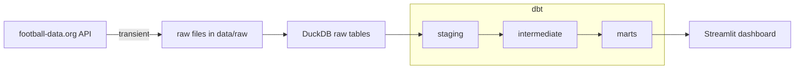

# football-pipeline

Data design decisions:

I did insert only for matches because one match's data can't change once it's already finished and I only ingest them if they are finished; I did upserts for scorers because one scorer's data can be updated over time.
I chose to split player data up into two tables because I wanted to avoid a fully denormalized table with static attributes and changing attributes, so one table has attributes that can change across seasons and one has permanent attributes.

Marts:
    dim_teams - Lookup table, one row per team. Join to fact tables on team_id to enrich results with team names and attributes.
    dim_players - Lookup table, one row per player. Join to fct_player_season on player_id to enrich player stats with personal attributes.
    fct_game_results - One row per match. Use this table to analyze match outcomes, goal totals by match, and home vs. away performance across the season.
    fct_player_season - one row per player-season combination. Use this table to analyze player scoring stats by team/season

